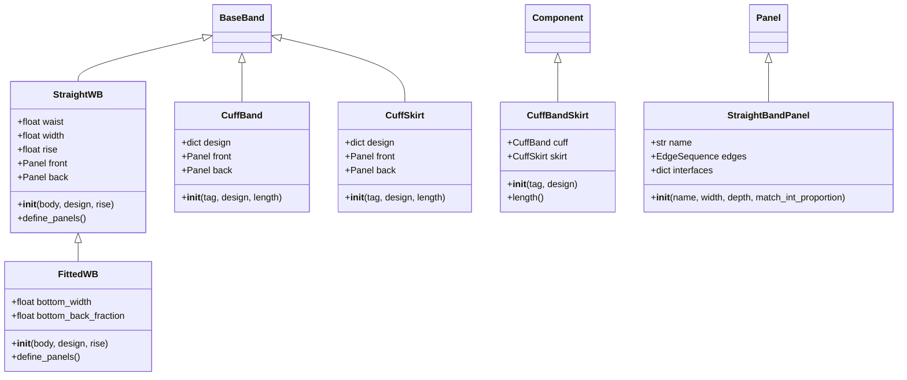

```mermaid
classDiagram
    BaseBand <|-- StraightWB
    StraightWB <|-- FittedWB
    BaseBand <|-- CuffBand
    BaseBand <|-- CuffSkirt
    Component <|-- CuffBandSkirt
    Panel <|-- StraightBandPanel

    StraightBandPanel : +str name
    StraightBandPanel : +EdgeSequence edges
    StraightBandPanel : +dict interfaces
    StraightBandPanel : +__init__(name, width, depth, match_int_proportion)

    StraightWB : +float waist
    StraightWB : +float width
    StraightWB : +float rise
    StraightWB : +Panel front
    StraightWB : +Panel back
    StraightWB : +__init__(body, design, rise)
    StraightWB : +define_panels()

    FittedWB : +float bottom_width
    FittedWB : +float bottom_back_fraction
    FittedWB : +__init__(body, design, rise)
    FittedWB : +define_panels()

    CuffBand : +dict design
    CuffBand : +Panel front
    CuffBand : +Panel back
    CuffBand : +__init__(tag, design, length)

    CuffSkirt : +dict design
    CuffSkirt : +Panel front
    CuffSkirt : +Panel back
    CuffSkirt : +__init__(tag, design, length)

    CuffBandSkirt : +CuffBand cuff
    CuffBandSkirt : +CuffSkirt skirt
    CuffBandSkirt : +__init__(tag, design)
    CuffBandSkirt : +length()
```