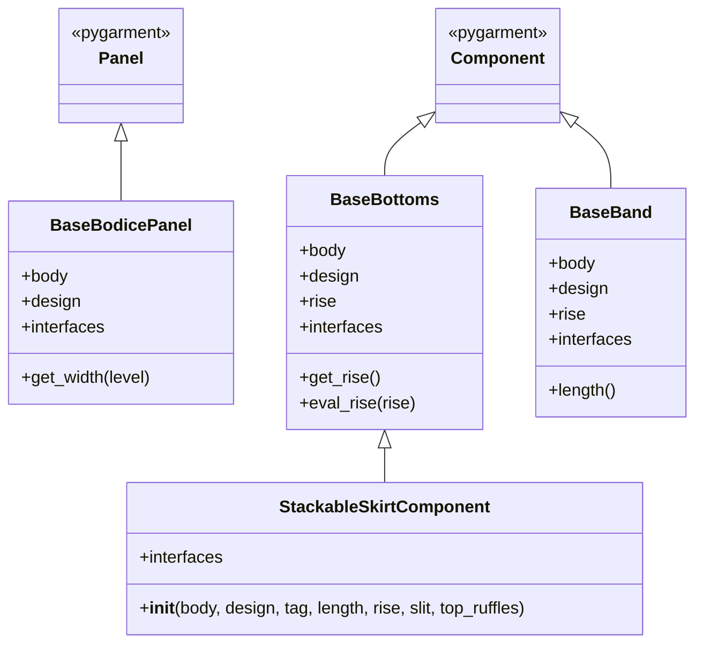

```mermaid
classDiagram
    class Panel {
        <<pygarment>>
    }
    class Component {
        <<pygarment>>
    }
    
    class BaseBodicePanel {
        +body
        +design
        +interfaces
        +get_width(level)
    }
    
    class BaseBottoms {
        +body
        +design
        +rise
        +interfaces
        +get_rise()
        +eval_rise(rise)
    }
    
    class StackableSkirtComponent {
        +interfaces
        +__init__(body, design, tag, length, rise, slit, top_ruffles)
    }
    
    class BaseBand {
        +body
        +design
        +rise
        +interfaces
        +length()
    }
    
    Panel <|-- BaseBodicePanel
    Component <|-- BaseBottoms
    BaseBottoms <|-- StackableSkirtComponent
    Component <|-- BaseBand

```