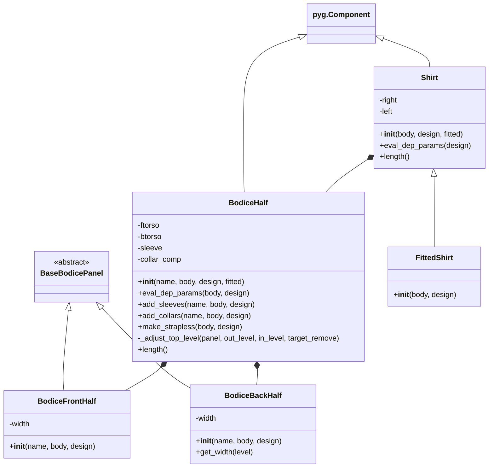

This diagram shows:

1. Inheritance relationships:
* BodiceFrontHalf and BodiceBackHalf inherit from BaseBodicePanel
* BodiceHalf and Shirt inherit from pyg.Component
* FittedShirt inherits from Shirt

2. Composition relationships:
* BodiceHalf contains BodiceFrontHalf and BodiceBackHalf
* Shirt contains two BodiceHalf instances (right and left)
* Key methods and attributes for each class

