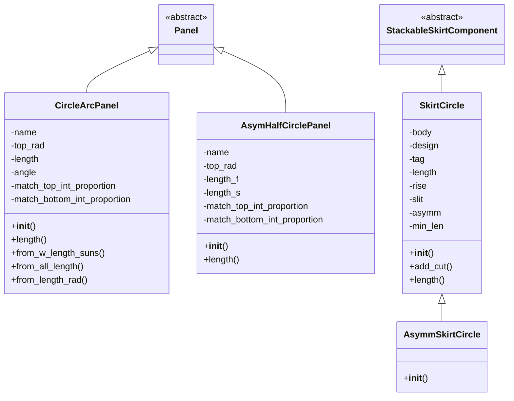

```mermaid
classDiagram
    Panel <|-- CircleArcPanel
    Panel <|-- AsymHalfCirclePanel
    StackableSkirtComponent <|-- SkirtCircle
    SkirtCircle <|-- AsymmSkirtCircle

    class Panel {
        <<abstract>>
    }

    class CircleArcPanel {
        -name
        -top_rad
        -length
        -angle
        -match_top_int_proportion
        -match_bottom_int_proportion
        +__init__()
        +length()
        +from_w_length_suns()
        +from_all_length()
        +from_length_rad()
    }

    class AsymHalfCirclePanel {
        -name
        -top_rad
        -length_f
        -length_s
        -match_top_int_proportion
        -match_bottom_int_proportion
        +__init__()
        +length()
    }

    class StackableSkirtComponent {
        <<abstract>>
    }

    class SkirtCircle {
        -body
        -design
        -tag
        -length
        -rise
        -slit
        -asymm
        -min_len
        +__init__()
        +add_cut()
        +length()
    }

    class AsymmSkirtCircle {
        +__init__()
    }
```