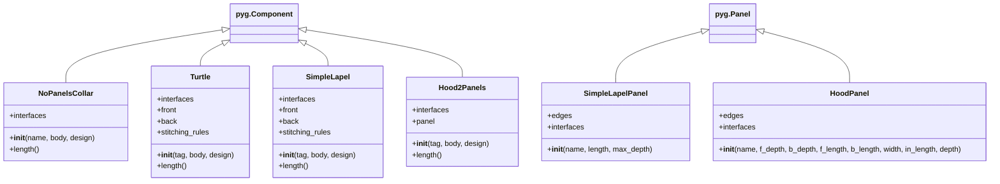

The diagram shows the inheritance relationships and main attributes/methods for each class. The classes inherit from either ``pyg.Component`` or ``pyg.Panel`` base classes. Each class has its own specific implementation of ``__init__()`` with different parameters, and most component classes implement a ``length()`` method.

The main collar types represented are:

* Basic collar without panels (NoPanelsCollar)
* Turtle neck style collar (Turtle)
* Lapel style collar (SimpleLapel with SimpleLapelPanel)
* Hood style collar (Hood2Panels with HoodPanel)

Each class manages its own interfaces and stitching rules for connecting the collar components together.

