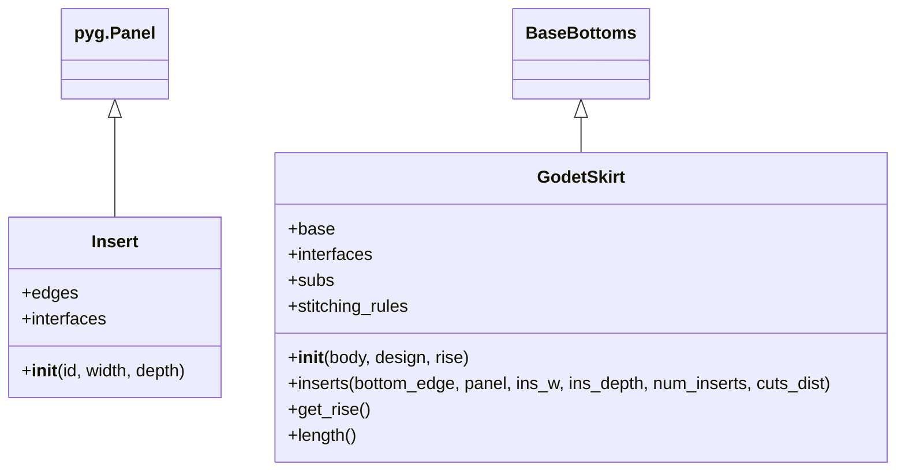

```mermaid
classDiagram
    class Insert {
        +edges
        +interfaces
        +__init__(id, width, depth)
    }

    class GodetSkirt {
        +base
        +interfaces
        +subs
        +stitching_rules
        +__init__(body, design, rise)
        +inserts(bottom_edge, panel, ins_w, ins_depth, num_inserts, cuts_dist)
        +get_rise()
        +length()
    }

    pyg.Panel <|-- Insert
    BaseBottoms <|-- GodetSkirt
```