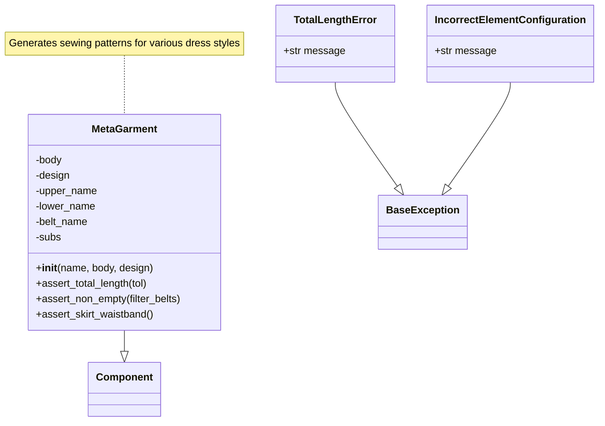

```mermaid
classDiagram
    class TotalLengthError {
        +str message
    }
    class IncorrectElementConfiguration {
        +str message
    }
    class MetaGarment {
        -body
        -design
        -upper_name
        -lower_name 
        -belt_name
        -subs
        +__init__(name, body, design)
        +assert_total_length(tol)
        +assert_non_empty(filter_belts)
        +assert_skirt_waistband()
    }

    TotalLengthError --|> BaseException
    IncorrectElementConfiguration --|> BaseException
    MetaGarment --|> Component

    note for MetaGarment "Generates sewing patterns for various dress styles"
```