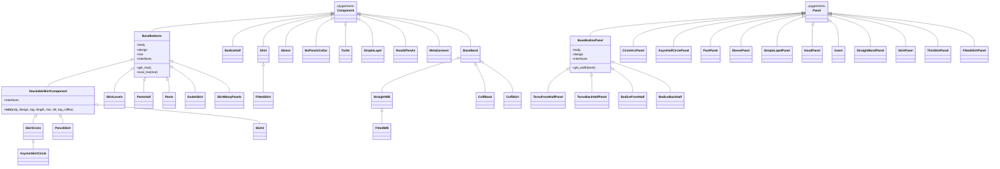

```mermaid
classDiagram
    %% Base Classes
    class Panel {
        <<pygarment>>
    }
    class Component {
        <<pygarment>>
    }
    
    %% Base Abstract Classes
    class BaseBodicePanel {
        +body
        +design
        +interfaces
        +get_width(level)
    }
    
    class BaseBottoms {
        +body
        +design
        +rise
        +interfaces
        +get_rise()
        +eval_rise(rise)
    }
    
    class StackableSkirtComponent {
        +interfaces
        +__init__(body, design, tag, length, rise, slit, top_ruffles)
    }
    
    %% Inheritance from Base Classes
    Panel <|-- BaseBodicePanel
    Component <|-- BaseBottoms
    BaseBottoms <|-- StackableSkirtComponent
    
    %% T-Shirt Related
    BaseBodicePanel <|-- TorsoFrontHalfPanel
    BaseBodicePanel <|-- TorsoBackHalfPanel
    
    %% Bodice Related
    BaseBodicePanel <|-- BodiceFrontHalf
    BaseBodicePanel <|-- BodiceBackHalf
    Component <|-- BodiceHalf
    Component <|-- Shirt
    Shirt <|-- FittedShirt
    
    %% Skirt Related
    Panel <|-- CircleArcPanel
    Panel <|-- AsymHalfCirclePanel
    StackableSkirtComponent <|-- SkirtCircle
    SkirtCircle <|-- AsymmSkirtCircle
    BaseBottoms <|-- SkirtLevels
    
    %% Pants Related
    BaseBottoms <|-- PantsHalf
    BaseBottoms <|-- Pants
    Panel <|-- PantPanel
    
    %% Sleeve Related
    Panel <|-- SleevePanel
    Component <|-- Sleeve
    
    %% Collar Related
    Component <|-- NoPanelsCollar
    Component <|-- Turtle
    Panel <|-- SimpleLapelPanel
    Component <|-- SimpleLapel
    Panel <|-- HoodPanel
    Component <|-- Hood2Panels
    
    %% Godet Related
    Panel <|-- Insert
    BaseBottoms <|-- GodetSkirt
    
    %% Meta Garment
    Component <|-- MetaGarment
    
    %% Bands
    Component <|-- BaseBand
    BaseBand <|-- StraightWB
    StraightWB <|-- FittedWB
    BaseBand <|-- CuffBand
    BaseBand <|-- CuffSkirt
    Panel <|-- StraightBandPanel
    
    %% Paneled Skirt
    Panel <|-- SkirtPanel
    Panel <|-- ThinSkirtPanel
    Panel <|-- FittedSkirtPanel
    BaseBottoms <|-- SkirtManyPanels
    StackableSkirtComponent <|-- PencilSkirt
    StackableSkirtComponent <|-- Skirt2
```