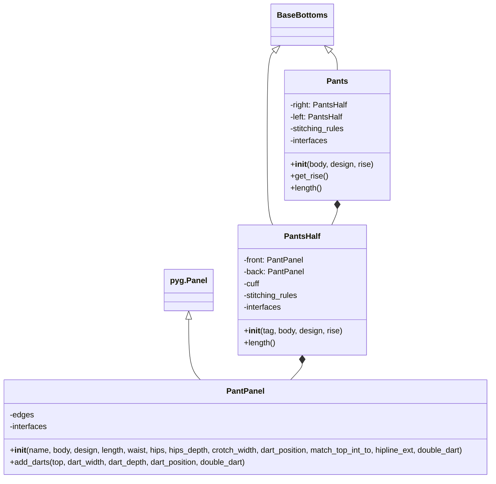

```mermaid
classDiagram
    class PantPanel {
        +__init__(name, body, design, length, waist, hips, hips_depth, crotch_width, dart_position, match_top_int_to, hipline_ext, double_dart)
        +add_darts(top, dart_width, dart_depth, dart_position, double_dart)
        -edges
        -interfaces
    }

    class PantsHalf {
        +__init__(tag, body, design, rise)
        +length()
        -front: PantPanel
        -back: PantPanel
        -cuff
        -stitching_rules
        -interfaces
    }

    class Pants {
        +__init__(body, design, rise)
        +get_rise()
        +length()
        -right: PantsHalf
        -left: PantsHalf
        -stitching_rules
        -interfaces
    }

    BaseBottoms <|-- PantsHalf
    BaseBottoms <|-- Pants
    pyg.Panel <|-- PantPanel
    PantsHalf *-- PantPanel
    Pants *-- PantsHalf

```