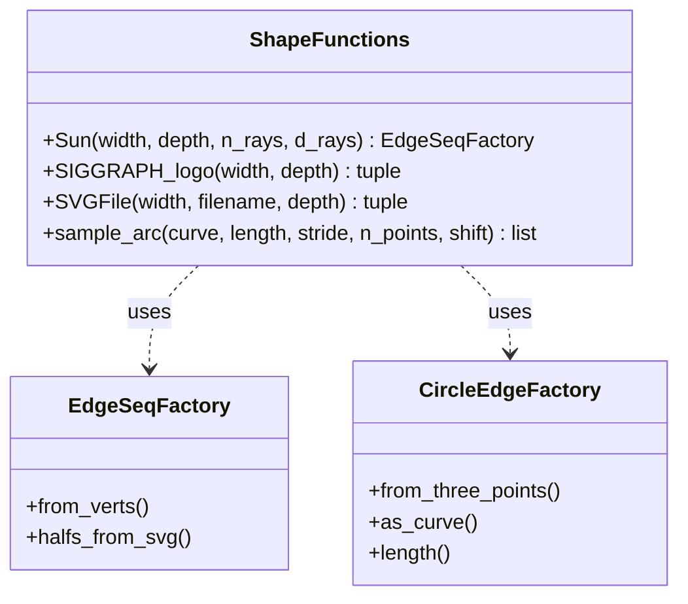

```mermaid
classDiagram
    class ShapeFunctions {
        +Sun(width, depth, n_rays, d_rays) EdgeSeqFactory
        +SIGGRAPH_logo(width, depth) tuple
        +SVGFile(width, filename, depth) tuple
        +sample_arc(curve, length, stride, n_points, shift) list
    }

    class EdgeSeqFactory {
        +from_verts()
        +halfs_from_svg()
    }

    class CircleEdgeFactory {
        +from_three_points()
        +as_curve()
        +length()
    }

    ShapeFunctions ..> EdgeSeqFactory : uses
    ShapeFunctions ..> CircleEdgeFactory : uses
```