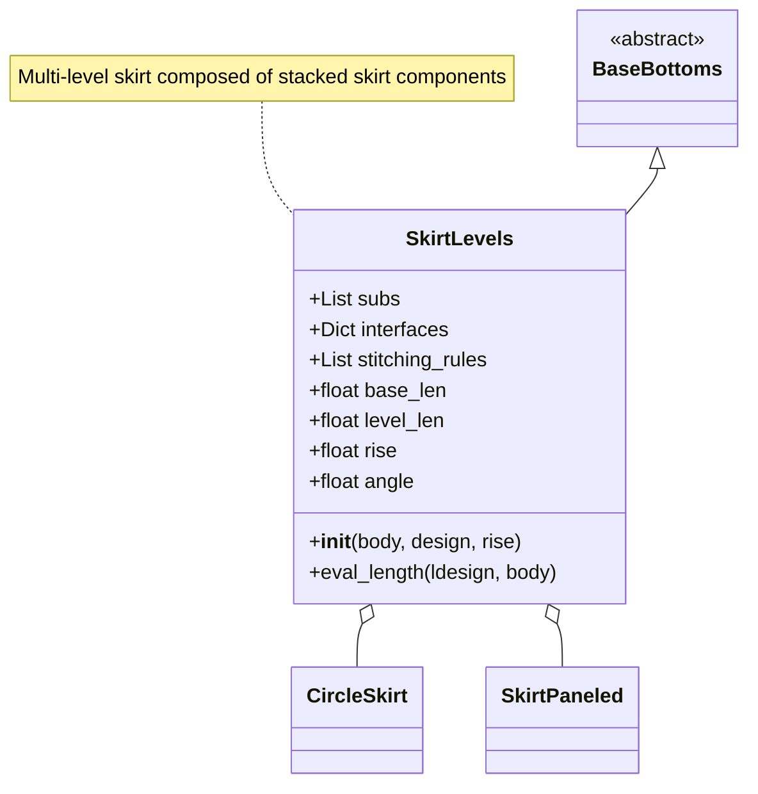

```mermaid
classDiagram
    BaseBottoms <|-- SkirtLevels
    SkirtLevels o-- CircleSkirt
    SkirtLevels o-- SkirtPaneled

    class SkirtLevels {
        +List subs
        +Dict interfaces
        +List stitching_rules
        +float base_len
        +float level_len
        +float rise
        +float angle
        +__init__(body, design, rise)
        +eval_length(ldesign, body)
    }

    class BaseBottoms {
        <<abstract>>
    }

    note for SkirtLevels "Multi-level skirt composed of stacked skirt components"
```