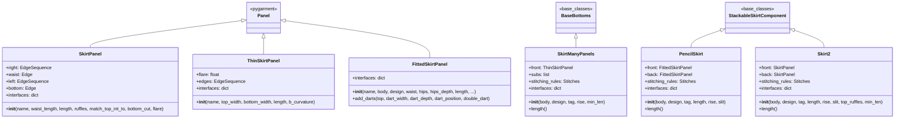

```mermaid
classDiagram
    class Panel {
        <<pygarment>>
    }
    class BaseBottoms {
        <<base_classes>>
    }
    class StackableSkirtComponent {
        <<base_classes>>
    }

    Panel <|-- SkirtPanel
    Panel <|-- ThinSkirtPanel
    Panel <|-- FittedSkirtPanel
    
    BaseBottoms <|-- SkirtManyPanels
    StackableSkirtComponent <|-- PencilSkirt
    StackableSkirtComponent <|-- Skirt2

    class SkirtPanel {
        +__init__(name, waist_length, length, ruffles, match_top_int_to, bottom_cut, flare)
        +right: EdgeSequence
        +waist: Edge
        +left: EdgeSequence
        +bottom: Edge
        +interfaces: dict
    }

    class ThinSkirtPanel {
        +__init__(name, top_width, bottom_width, length, b_curvature)
        +flare: float
        +edges: EdgeSequence
        +interfaces: dict
    }

    class FittedSkirtPanel {
        +__init__(name, body, design, waist, hips, hips_depth, length, ...)
        +add_darts(top, dart_width, dart_depth, dart_position, double_dart)
        +interfaces: dict
    }

    class PencilSkirt {
        +__init__(body, design, tag, length, rise, slit)
        +front: FittedSkirtPanel
        +back: FittedSkirtPanel
        +stitching_rules: Stitches
        +interfaces: dict
        +length()
    }

    class Skirt2 {
        +__init__(body, design, tag, length, rise, slit, top_ruffles, min_len)
        +front: SkirtPanel
        +back: SkirtPanel
        +stitching_rules: Stitches
        +interfaces: dict
        +length()
    }

    class SkirtManyPanels {
        +__init__(body, design, tag, rise, min_len)
        +front: ThinSkirtPanel
        +subs: list
        +stitching_rules: Stitches
        +interfaces: dict
        +length()
    }
```