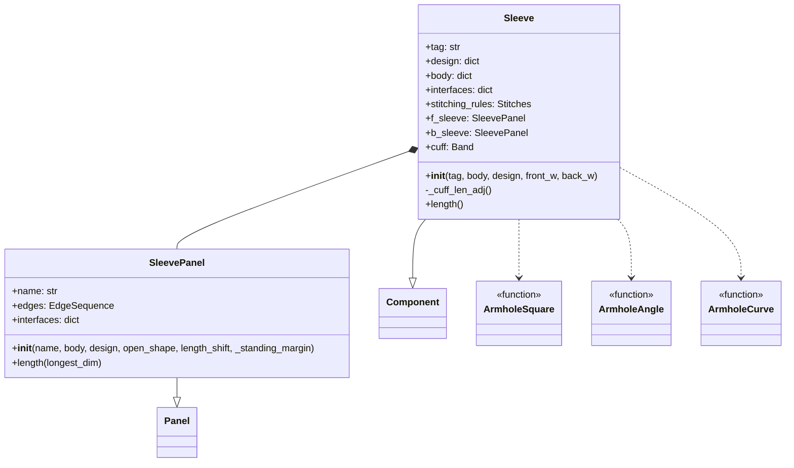

```mermaid
classDiagram
    class SleevePanel {
        +name: str
        +edges: EdgeSequence
        +interfaces: dict
        +__init__(name, body, design, open_shape, length_shift, _standing_margin)
        +length(longest_dim)
    }
    class Sleeve {
        +tag: str
        +design: dict
        +body: dict
        +interfaces: dict
        +stitching_rules: Stitches
        +f_sleeve: SleevePanel
        +b_sleeve: SleevePanel
        +cuff: Band
        +__init__(tag, body, design, front_w, back_w)
        -_cuff_len_adj()
        +length()
    }

    SleevePanel --|> Panel
    Sleeve --|> Component

    %% Functions
    class ArmholeSquare {
        <<function>>
    }
    class ArmholeAngle {
        <<function>>
    }
    class ArmholeCurve {
        <<function>>
    }

    Sleeve ..> ArmholeSquare
    Sleeve ..> ArmholeAngle 
    Sleeve ..> ArmholeCurve
    Sleeve *-- SleevePanel
```