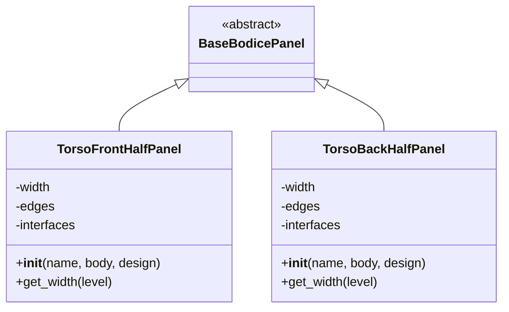

```mermaid
classDiagram
    BaseBodicePanel <|-- TorsoFrontHalfPanel
    BaseBodicePanel <|-- TorsoBackHalfPanel

    class BaseBodicePanel {
        <<abstract>>
    }

    class TorsoFrontHalfPanel {
        -width
        -edges
        -interfaces
        +__init__(name, body, design)
        +get_width(level)
    }

    class TorsoBackHalfPanel {
        -width
        -edges
        -interfaces
        +__init__(name, body, design)
        +get_width(level)
    }
```