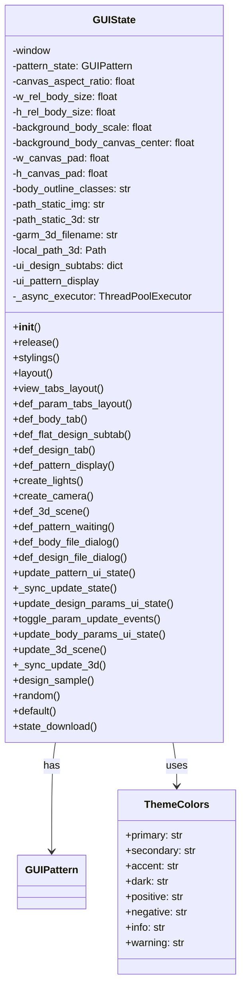

```mermaid
classDiagram
    class GUIState {
        -window
        -pattern_state: GUIPattern
        -canvas_aspect_ratio: float
        -w_rel_body_size: float
        -h_rel_body_size: float
        -background_body_scale: float
        -background_body_canvas_center: float
        -w_canvas_pad: float
        -h_canvas_pad: float
        -body_outline_classes: str
        -path_static_img: str
        -path_static_3d: str
        -garm_3d_filename: str
        -local_path_3d: Path
        -ui_design_subtabs: dict
        -ui_pattern_display
        -_async_executor: ThreadPoolExecutor
        +__init__()
        +release()
        +stylings()
        +layout()
        +view_tabs_layout()
        +def_param_tabs_layout()
        +def_body_tab()
        +def_flat_design_subtab()
        +def_design_tab()
        +def_pattern_display()
        +create_lights()
        +create_camera()
        +def_3d_scene()
        +def_pattern_waiting()
        +def_body_file_dialog()
        +def_design_file_dialog()
        +update_pattern_ui_state()
        +_sync_update_state()
        +update_design_params_ui_state()
        +toggle_param_update_events()
        +update_body_params_ui_state()
        +update_3d_scene()
        +_sync_update_3d()
        +design_sample()
        +random()
        +default()
        +state_download()
    }

    class ThemeColors {
        +primary: str
        +secondary: str
        +accent: str
        +dark: str
        +positive: str
        +negative: str
        +info: str
        +warning: str
    }

    GUIState --> GUIPattern : has
    GUIState --> ThemeColors : uses
```