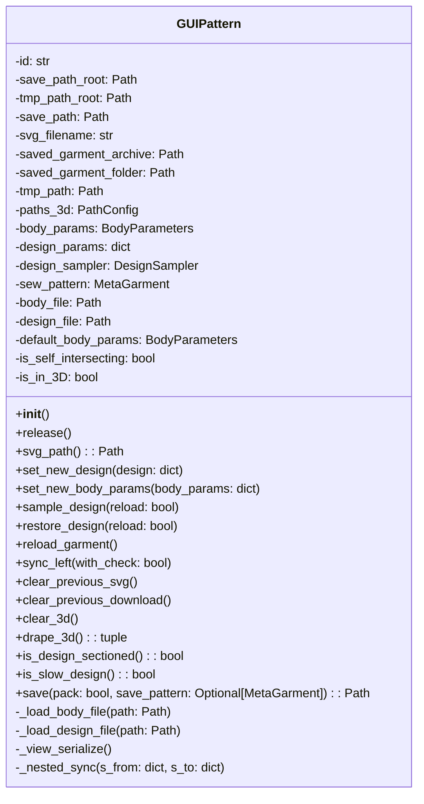

```mermaid
classDiagram
    class GUIPattern {
        -id: str
        -save_path_root: Path
        -tmp_path_root: Path
        -save_path: Path
        -svg_filename: str
        -saved_garment_archive: Path
        -saved_garment_folder: Path
        -tmp_path: Path
        -paths_3d: PathConfig
        -body_params: BodyParameters
        -design_params: dict
        -design_sampler: DesignSampler
        -sew_pattern: MetaGarment
        -body_file: Path
        -design_file: Path
        -default_body_params: BodyParameters
        -is_self_intersecting: bool
        -is_in_3D: bool
        +__init__()
        +release()
        +svg_path(): Path
        +set_new_design(design: dict)
        +set_new_body_params(body_params: dict)
        +sample_design(reload: bool)
        +restore_design(reload: bool)
        +reload_garment()
        +sync_left(with_check: bool)
        +clear_previous_svg()
        +clear_previous_download()
        +clear_3d()
        +drape_3d(): tuple
        +is_design_sectioned(): bool
        +is_slow_design(): bool
        +save(pack: bool, save_pattern: Optional[MetaGarment]): Path
        -_load_body_file(path: Path)
        -_load_design_file(path: Path)
        -_view_serialize()
        -_nested_sync(s_from: dict, s_to: dict)
    }

```