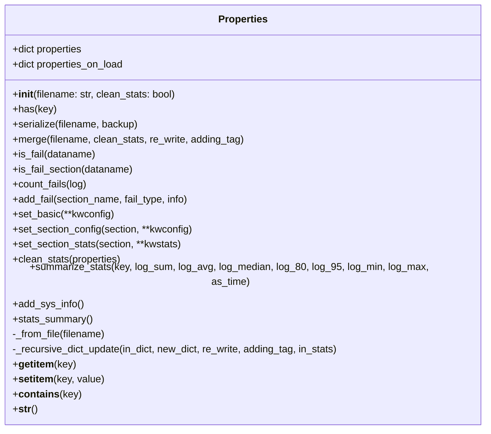

```mermaid
classDiagram
    class Properties {
        +dict properties
        +dict properties_on_load
        +__init__(filename: str, clean_stats: bool)
        +has(key)
        +serialize(filename, backup)
        +merge(filename, clean_stats, re_write, adding_tag)
        +is_fail(dataname)
        +is_fail_section(dataname)
        +count_fails(log)
        +add_fail(section_name, fail_type, info)
        +set_basic(**kwconfig)
        +set_section_config(section, **kwconfig)
        +set_section_stats(section, **kwstats)
        +clean_stats(properties)
        +summarize_stats(key, log_sum, log_avg, log_median, log_80, log_95, log_min, log_max, as_time)
        +add_sys_info()
        +stats_summary()
        -_from_file(filename)
        -_recursive_dict_update(in_dict, new_dict, re_write, adding_tag, in_stats)
        +__getitem__(key)
        +__setitem__(key, value) 
        +__contains__(key)
        +__str__()
    }
```