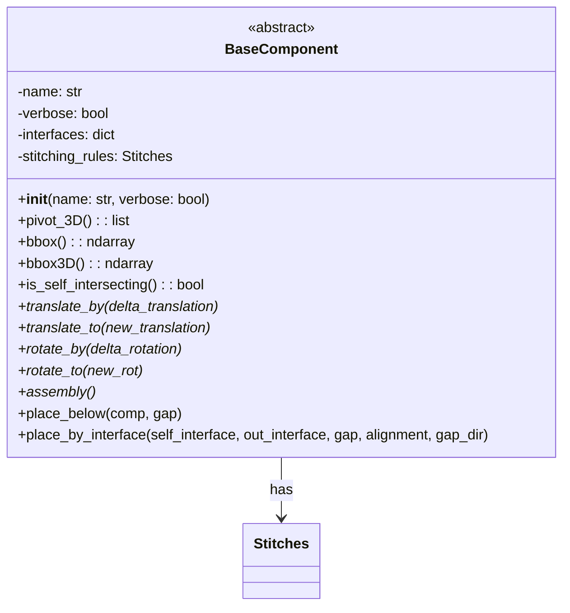

```mermaid
classDiagram
    class BaseComponent {
        <<abstract>>
        -name: str
        -verbose: bool
        -interfaces: dict
        -stitching_rules: Stitches
        +__init__(name: str, verbose: bool)
        +pivot_3D(): list
        +bbox(): ndarray
        +bbox3D(): ndarray
        +is_self_intersecting(): bool
        +translate_by(delta_translation)*
        +translate_to(new_translation)*
        +rotate_by(delta_rotation)*
        +rotate_to(new_rot)*
        +assembly()*
        +place_below(comp, gap)
        +place_by_interface(self_interface, out_interface, gap, alignment, gap_dir)
    }

    class Stitches {
    }

    BaseComponent --> Stitches : has
```