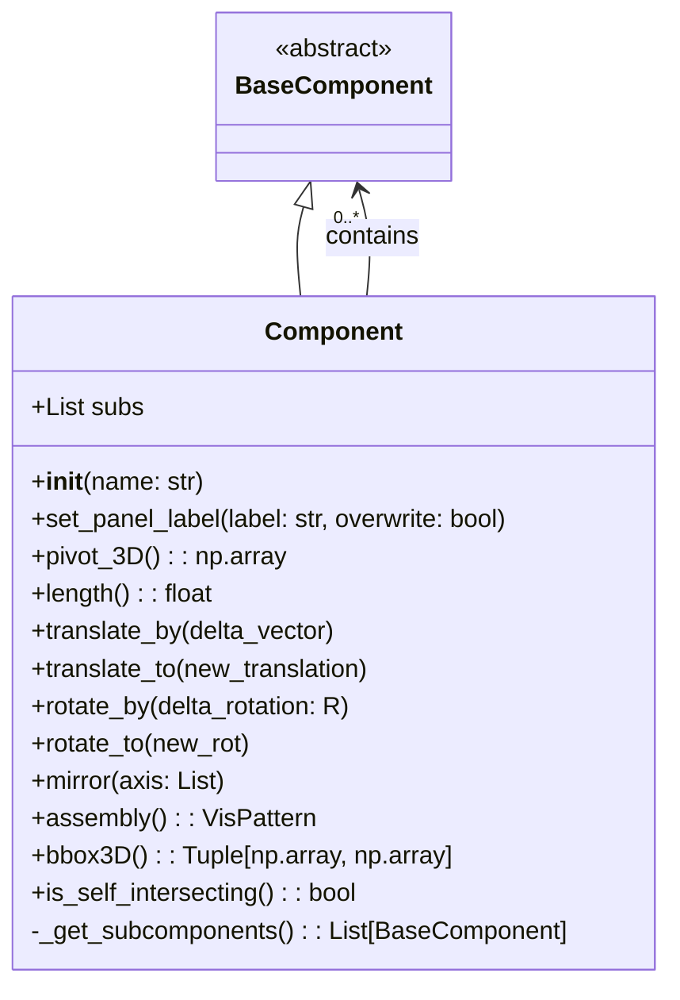

```mermaid
classDiagram
    BaseComponent <|-- Component

    class Component {
        +List subs
        +__init__(name: str)
        +set_panel_label(label: str, overwrite: bool)
        +pivot_3D(): np.array
        +length(): float
        +translate_by(delta_vector)
        +translate_to(new_translation)
        +rotate_by(delta_rotation: R)
        +rotate_to(new_rot)
        +mirror(axis: List)
        +assembly(): VisPattern
        +bbox3D(): Tuple[np.array, np.array]
        +is_self_intersecting(): bool
        -_get_subcomponents(): List[BaseComponent]
    }

    class BaseComponent {
        <<abstract>>
    }

    Component --> "0..*" BaseComponent : contains

```