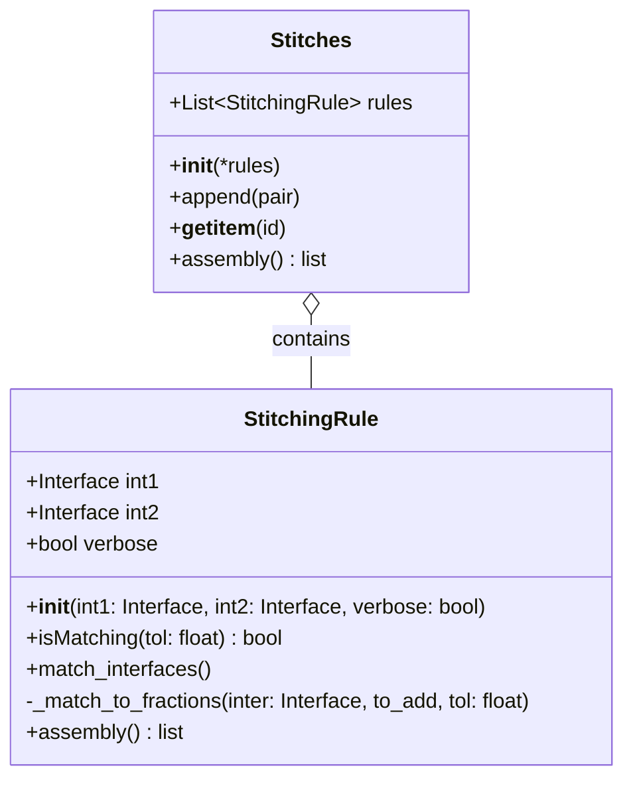

```mermaid
classDiagram
    class StitchingRule {
        +Interface int1
        +Interface int2
        +bool verbose
        +__init__(int1: Interface, int2: Interface, verbose: bool)
        +isMatching(tol: float) bool
        +match_interfaces()
        -_match_to_fractions(inter: Interface, to_add, tol: float)
        +assembly() list
    }

    class Stitches {
        +List~StitchingRule~ rules
        +__init__(*rules)
        +append(pair)
        +__getitem__(id)
        +assembly() list
    }

    Stitches o-- StitchingRule : contains

```