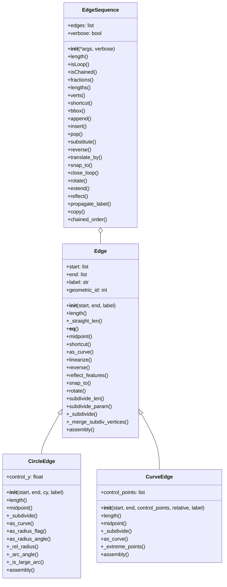

```mermaid
classDiagram
    class Edge {
        +start: list
        +end: list
        +label: str
        +geometric_id: int
        +__init__(start, end, label)
        +length()
        +_straight_len()
        +__eq__()
        +midpoint()
        +shortcut()
        +as_curve()
        +linearize()
        +reverse()
        +reflect_features()
        +snap_to()
        +rotate()
        +subdivide_len()
        +subdivide_param()
        +_subdivide()
        +_merge_subdiv_vertices()
        +assembly()
    }

    class CircleEdge {
        +control_y: float
        +__init__(start, end, cy, label)
        +length()
        +midpoint()
        +_subdivide()
        +as_curve()
        +as_radius_flag()
        +as_radius_angle()
        +_rel_radius()
        +_arc_angle()
        +_is_large_arc()
        +assembly()
    }

    class CurveEdge {
        +control_points: list
        +__init__(start, end, control_points, relative, label)
        +length()
        +midpoint()
        +_subdivide()
        +as_curve()
        +_extreme_points()
        +assembly()
    }

    class EdgeSequence {
        +edges: list
        +verbose: bool
        +__init__(*args, verbose)
        +length()
        +isLoop()
        +isChained()
        +fractions()
        +lengths()
        +verts()
        +shortcut()
        +bbox()
        +append()
        +insert()
        +pop()
        +substitute()
        +reverse()
        +translate_by()
        +snap_to()
        +close_loop()
        +rotate()
        +extend()
        +reflect()
        +propagate_label()
        +copy()
        +chained_order()
    }

    Edge <|-- CircleEdge
    Edge <|-- CurveEdge
    EdgeSequence o-- Edge


```