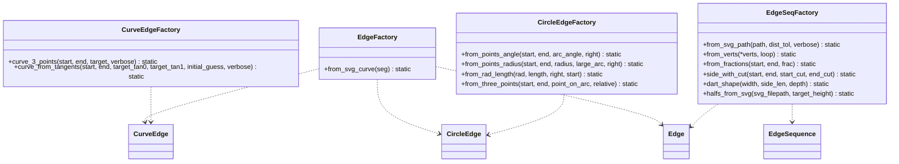

```mermaid
classDiagram
    class EdgeFactory {
        +from_svg_curve(seg) static
    }

    class CircleEdgeFactory {
        +from_points_angle(start, end, arc_angle, right) static
        +from_points_radius(start, end, radius, large_arc, right) static
        +from_rad_length(rad, length, right, start) static
        +from_three_points(start, end, point_on_arc, relative) static
    }

    class CurveEdgeFactory {
        +curve_3_points(start, end, target, verbose) static
        +curve_from_tangents(start, end, target_tan0, target_tan1, initial_guess, verbose) static
    }

    class EdgeSeqFactory {
        +from_svg_path(path, dist_tol, verbose) static
        +from_verts(*verts, loop) static
        +from_fractions(start, end, frac) static
        +side_with_cut(start, end, start_cut, end_cut) static
        +dart_shape(width, side_len, depth) static
        +halfs_from_svg(svg_filepath, target_height) static
    }

    EdgeFactory ..> CurveEdge
    CurveEdgeFactory ..> CurveEdge
    EdgeFactory ..> CircleEdge
    EdgeFactory ..> Edge
    
    CircleEdgeFactory ..> CircleEdge
    EdgeSeqFactory ..> EdgeSequence
    EdgeSeqFactory ..> Edge

```