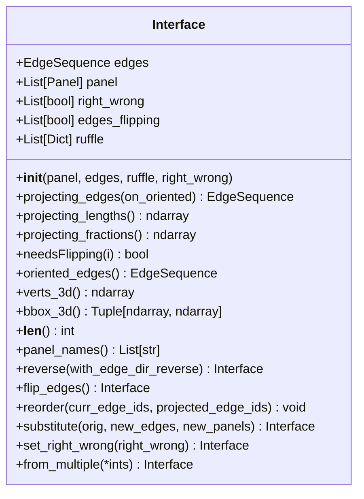

```mermaid
classDiagram
    class Interface {
        +EdgeSequence edges
        +List[Panel] panel
        +List[bool] right_wrong
        +List[bool] edges_flipping
        +List[Dict] ruffle

        +__init__(panel, edges, ruffle, right_wrong)
        +projecting_edges(on_oriented) EdgeSequence
        +projecting_lengths() ndarray
        +projecting_fractions() ndarray
        +needsFlipping(i) bool
        +oriented_edges() EdgeSequence
        +verts_3d() ndarray
        +bbox_3d() Tuple[ndarray, ndarray]
        +__len__() int
        +panel_names() List[str]
        +reverse(with_edge_dir_reverse) Interface
        +flip_edges() Interface
        +reorder(curr_edge_ids, projected_edge_ids) void
        +substitute(orig, new_edges, new_panels) Interface
        +set_right_wrong(right_wrong) Interface
        +from_multiple(*ints) Interface
    }
```