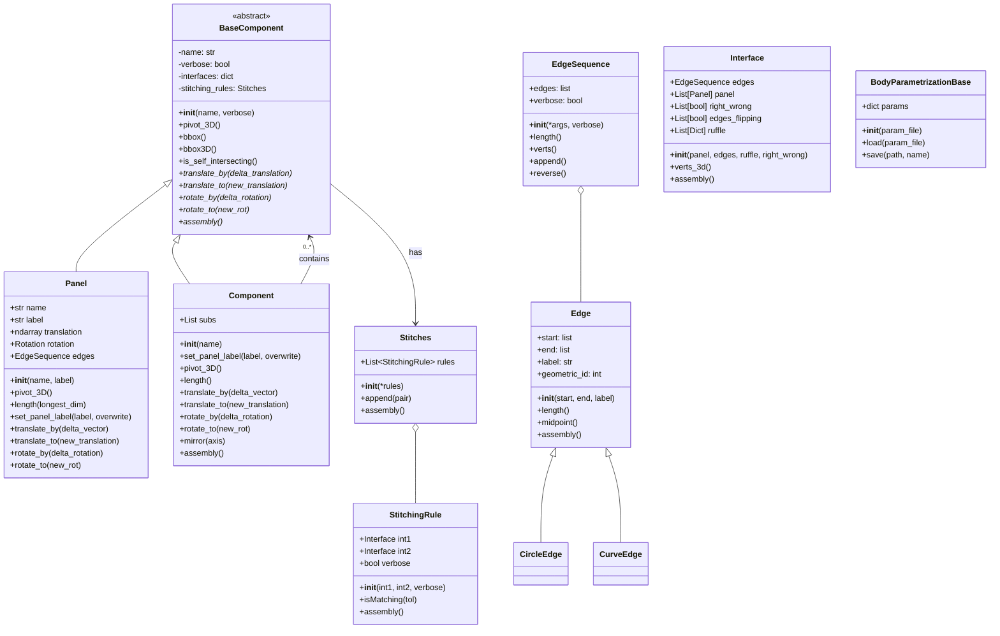

```mermaid
classDiagram
    BaseComponent <|-- Panel
    BaseComponent <|-- Component
    Component --> "0..*" BaseComponent : contains
    EdgeSequence o-- Edge
    Edge <|-- CircleEdge
    Edge <|-- CurveEdge
    Stitches o-- StitchingRule
    BaseComponent --> Stitches : has

    class BaseComponent {
        <<abstract>>
        -name: str
        -verbose: bool
        -interfaces: dict
        -stitching_rules: Stitches
        +__init__(name, verbose)
        +pivot_3D()
        +bbox()
        +bbox3D()
        +is_self_intersecting()
        +translate_by(delta_translation)*
        +translate_to(new_translation)*
        +rotate_by(delta_rotation)*
        +rotate_to(new_rot)*
        +assembly()*
    }

    class Component {
        +List subs
        +__init__(name)
        +set_panel_label(label, overwrite)
        +pivot_3D()
        +length()
        +translate_by(delta_vector)
        +translate_to(new_translation)
        +rotate_by(delta_rotation)
        +rotate_to(new_rot)
        +mirror(axis)
        +assembly()
    }

    class Panel {
        +str name
        +str label
        +ndarray translation
        +Rotation rotation
        +EdgeSequence edges
        +__init__(name, label)
        +pivot_3D()
        +length(longest_dim)
        +set_panel_label(label, overwrite)
        +translate_by(delta_vector)
        +translate_to(new_translation)
        +rotate_by(delta_rotation)
        +rotate_to(new_rot)
    }

    class Edge {
        +start: list
        +end: list
        +label: str
        +geometric_id: int
        +__init__(start, end, label)
        +length()
        +midpoint()
        +assembly()
    }

    class EdgeSequence {
        +edges: list
        +verbose: bool
        +__init__(*args, verbose)
        +length()
        +verts()
        +append()
        +reverse()
    }

    class StitchingRule {
        +Interface int1
        +Interface int2
        +bool verbose
        +__init__(int1, int2, verbose)
        +isMatching(tol)
        +assembly()
    }

    class Stitches {
        +List~StitchingRule~ rules
        +__init__(*rules)
        +append(pair)
        +assembly()
    }

    class Interface {
        +EdgeSequence edges
        +List[Panel] panel
        +List[bool] right_wrong
        +List[bool] edges_flipping
        +List[Dict] ruffle
        +__init__(panel, edges, ruffle, right_wrong)
        +verts_3d()
        +assembly()
    }

    class BodyParametrizationBase {
        +dict params
        +__init__(param_file)
        +load(param_file)
        +save(path, name)
    }
```