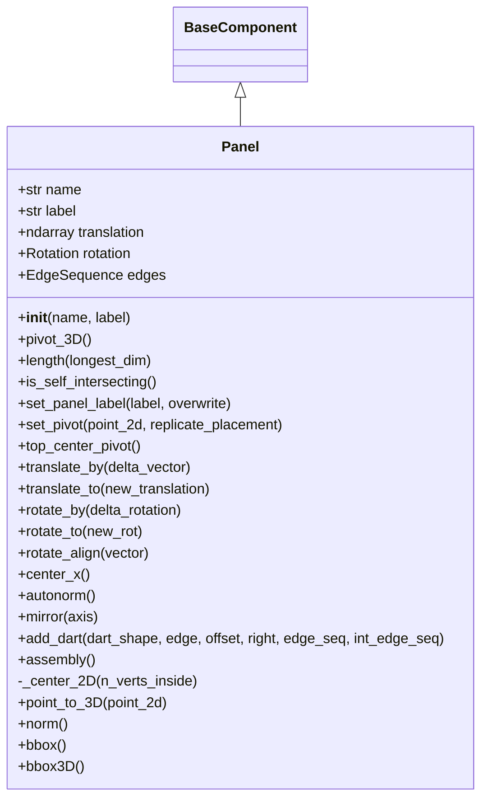

```mermaid
classDiagram
    BaseComponent <|-- Panel
    Panel : +str name
    Panel : +str label
    Panel : +ndarray translation
    Panel : +Rotation rotation
    Panel : +EdgeSequence edges
    
    Panel : +__init__(name, label)
    Panel : +pivot_3D()
    Panel : +length(longest_dim)
    Panel : +is_self_intersecting()
    Panel : +set_panel_label(label, overwrite)
    Panel : +set_pivot(point_2d, replicate_placement)
    Panel : +top_center_pivot()
    Panel : +translate_by(delta_vector)
    Panel : +translate_to(new_translation)
    Panel : +rotate_by(delta_rotation)
    Panel : +rotate_to(new_rot)
    Panel : +rotate_align(vector)
    Panel : +center_x()
    Panel : +autonorm()
    Panel : +mirror(axis)
    Panel : +add_dart(dart_shape, edge, offset, right, edge_seq, int_edge_seq)
    Panel : +assembly()
    Panel : -_center_2D(n_verts_inside)
    Panel : +point_to_3D(point_2d)
    Panel : +norm()
    Panel : +bbox()
    Panel : +bbox3D()
```