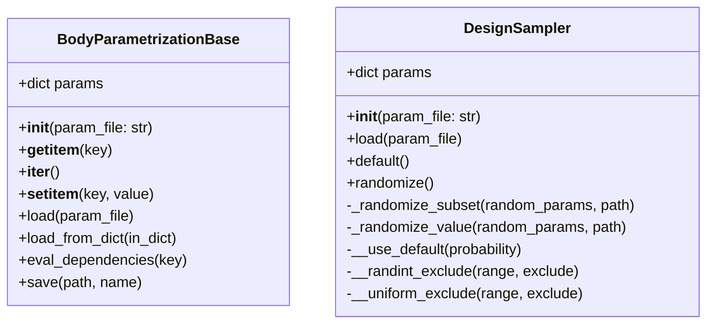

```mermaid
classDiagram
    class BodyParametrizationBase {
        +dict params
        +__init__(param_file: str)
        +__getitem__(key)
        +__iter__()
        +__setitem__(key, value)
        +load(param_file)
        +load_from_dict(in_dict)
        +eval_dependencies(key)
        +save(path, name)
    }

    class DesignSampler {
        +dict params
        +__init__(param_file: str)
        +load(param_file)
        +default()
        +randomize()
        -_randomize_subset(random_params, path)
        -_randomize_value(random_params, path)
        -__use_default(probability)
        -__randint_exclude(range, exclude)
        -__uniform_exclude(range, exclude)
    }
```