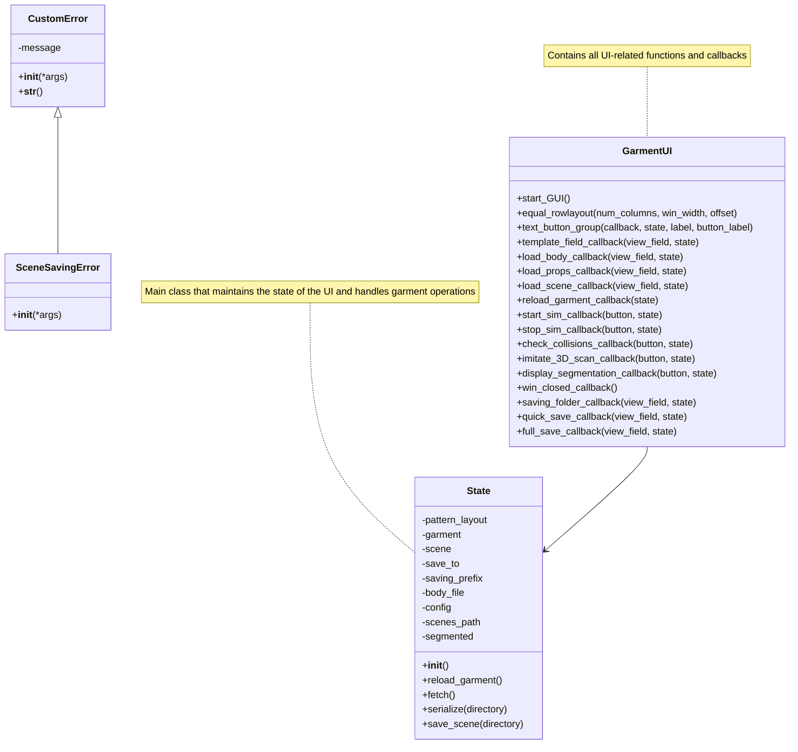

```mermaid
classDiagram

class State {
    -pattern_layout
    -garment
    -scene
    -save_to
    -saving_prefix
    -body_file
    -config
    -scenes_path
    -segmented
    +__init__()
    +reload_garment()
    +fetch()
    +serialize(directory)
    +save_scene(directory)
}

class CustomError {
    -message
    +__init__(*args)
    +__str__()
}

class SceneSavingError {
    +__init__(*args)
}

class GarmentUI {
    +start_GUI()
    +equal_rowlayout(num_columns, win_width, offset)
    +text_button_group(callback, state, label, button_label)
    +template_field_callback(view_field, state)
    +load_body_callback(view_field, state)
    +load_props_callback(view_field, state)
    +load_scene_callback(view_field, state)
    +reload_garment_callback(state)
    +start_sim_callback(button, state)
    +stop_sim_callback(button, state)
    +check_collisions_callback(button, state)
    +imitate_3D_scan_callback(button, state)
    +display_segmentation_callback(button, state)
    +win_closed_callback()
    +saving_folder_callback(view_field, state)
    +quick_save_callback(view_field, state)
    +full_save_callback(view_field, state)
}

CustomError <|-- SceneSavingError
GarmentUI --> State

note for State "Main class that maintains the state of the UI and handles garment operations"
note for GarmentUI "Contains all UI-related functions and callbacks"

```