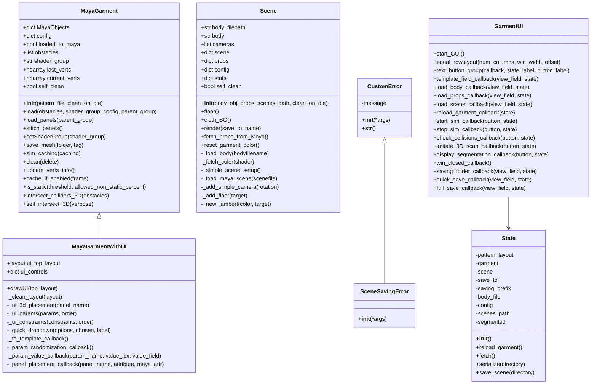

```mermaid
classDiagram
    class MayaGarment {
        +dict MayaObjects
        +dict config
        +bool loaded_to_maya
        +list obstacles
        +str shader_group
        +ndarray last_verts
        +ndarray current_verts
        +bool self_clean
        +__init__(pattern_file, clean_on_die)
        +load(obstacles, shader_group, config, parent_group)
        +load_panels(parent_group)
        +stitch_panels()
        +setShaderGroup(shader_group)
        +save_mesh(folder, tag)
        +sim_caching(caching)
        +clean(delete)
        +update_verts_info()
        +cache_if_enabled(frame)
        +is_static(threshold, allowed_non_static_percent)
        +intersect_colliders_3D(obstacles)
        +self_intersect_3D(verbose)
    }

    class MayaGarmentWithUI {
        +layout ui_top_layout
        +dict ui_controls
        +drawUI(top_layout)
        -_clean_layout(layout)
        -_ui_3d_placement(panel_name)
        -_ui_params(params, order)
        -_ui_constraints(constraints, order)
        -_quick_dropdown(options, chosen, label)
        -_to_template_callback()
        -_param_randomization_callback()
        -_param_value_callback(param_name, value_idx, value_field)
        -_panel_placement_callback(panel_name, attribute, maya_attr)
    }

    class Scene {
        +str body_filepath
        +str body
        +list cameras
        +dict scene
        +dict props
        +dict config
        +dict stats
        +bool self_clean
        +__init__(body_obj, props, scenes_path, clean_on_die)
        +floor()
        +cloth_SG()
        +render(save_to, name)
        +fetch_props_from_Maya()
        +reset_garment_color()
        -_load_body(bodyfilename)
        -_fetch_color(shader)
        -_simple_scene_setup()
        -_load_maya_scene(scenefile)
        -_add_simple_camera(rotation)
        -_add_floor(target)
        -_new_lambert(color, target)
    }

    class State {
        -pattern_layout
        -garment
        -scene
        -save_to
        -saving_prefix
        -body_file
        -config
        -scenes_path
        -segmented
        +__init__()
        +reload_garment()
        +fetch()
        +serialize(directory)
        +save_scene(directory)
    }

    class CustomError {
        -message
        +__init__(*args)
        +__str__()
    }

    class SceneSavingError {
        +__init__(*args)
    }

    class GarmentUI {
        +start_GUI()
        +equal_rowlayout(num_columns, win_width, offset)
        +text_button_group(callback, state, label, button_label)
        +template_field_callback(view_field, state)
        +load_body_callback(view_field, state)
        +load_props_callback(view_field, state)
        +load_scene_callback(view_field, state)
        +reload_garment_callback(state)
        +start_sim_callback(button, state)
        +stop_sim_callback(button, state)
        +check_collisions_callback(button, state)
        +imitate_3D_scan_callback(button, state)
        +display_segmentation_callback(button, state)
        +win_closed_callback()
        +saving_folder_callback(view_field, state)
        +quick_save_callback(view_field, state)
        +full_save_callback(view_field, state)
    }

    MayaGarment <|-- MayaGarmentWithUI
    CustomError <|-- SceneSavingError
    GarmentUI --> State
```