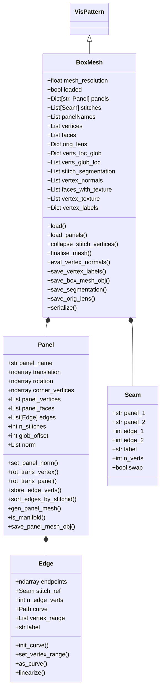

```mermaid
classDiagram
    VisPattern <|-- BoxMesh
    BoxMesh *-- Panel
    BoxMesh *-- Seam
    Panel *-- Edge

    class BoxMesh {
        +float mesh_resolution
        +bool loaded
        +Dict[str, Panel] panels
        +List[Seam] stitches
        +List panelNames
        +List vertices
        +List faces
        +Dict orig_lens
        +Dict verts_loc_glob
        +List verts_glob_loc
        +List stitch_segmentation
        +List vertex_normals
        +List faces_with_texture
        +List vertex_texture
        +Dict vertex_labels
        +load()
        +load_panels()
        +collapse_stitch_vertices()
        +finalise_mesh()
        +eval_vertex_normals()
        +save_vertex_labels()
        +save_box_mesh_obj()
        +save_segmentation()
        +save_orig_lens()
        +serialize()
    }

    class Panel {
        +str panel_name
        +ndarray translation
        +ndarray rotation 
        +ndarray corner_vertices
        +List panel_vertices
        +List panel_faces
        +List[Edge] edges
        +int n_stitches
        +int glob_offset
        +List norm
        +set_panel_norm()
        +rot_trans_vertex()
        +rot_trans_panel()
        +store_edge_verts()
        +sort_edges_by_stitchid()
        +gen_panel_mesh()
        +is_manifold()
        +save_panel_mesh_obj()
    }

    class Edge {
        +ndarray endpoints
        +Seam stitch_ref
        +int n_edge_verts
        +Path curve
        +List vertex_range
        +str label
        +init_curve()
        +set_vertex_range()
        +as_curve()
        +linearize()
    }

    class Seam {
        +str panel_1
        +str panel_2
        +int edge_1
        +int edge_2
        +str label
        +int n_verts
        +bool swap
    }
```