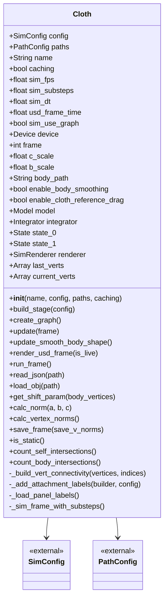

```mermaid
classDiagram
    class Cloth {
        +SimConfig config
        +PathConfig paths
        +String name
        +bool caching
        +float sim_fps
        +float sim_substeps
        +float sim_dt
        +float usd_frame_time
        +bool sim_use_graph
        +Device device
        +int frame
        +float c_scale
        +float b_scale
        +String body_path
        +bool enable_body_smoothing
        +bool enable_cloth_reference_drag
        +Model model
        +Integrator integrator
        +State state_0
        +State state_1
        +SimRenderer renderer
        +Array last_verts
        +Array current_verts

        +__init__(name, config, paths, caching)
        +build_stage(config)
        +create_graph()
        +update(frame)
        +update_smooth_body_shape()
        +render_usd_frame(is_live)
        +run_frame()
        +read_json(path)
        +load_obj(path)
        +get_shift_param(body_vertices)
        +calc_norm(a, b, c)
        +calc_vertex_norms()
        +save_frame(save_v_norms)
        +is_static()
        +count_self_intersections()
        +count_body_intersections()
        -_build_vert_connectivity(vertices, indices)
        -_add_attachment_labels(builder, config)
        -_load_panel_labels()
        -_sim_frame_with_substeps()
    }

    class SimConfig {
        <<external>>
    }

    class PathConfig {
        <<external>>
    }

    Cloth --> SimConfig
    Cloth --> PathConfig
```