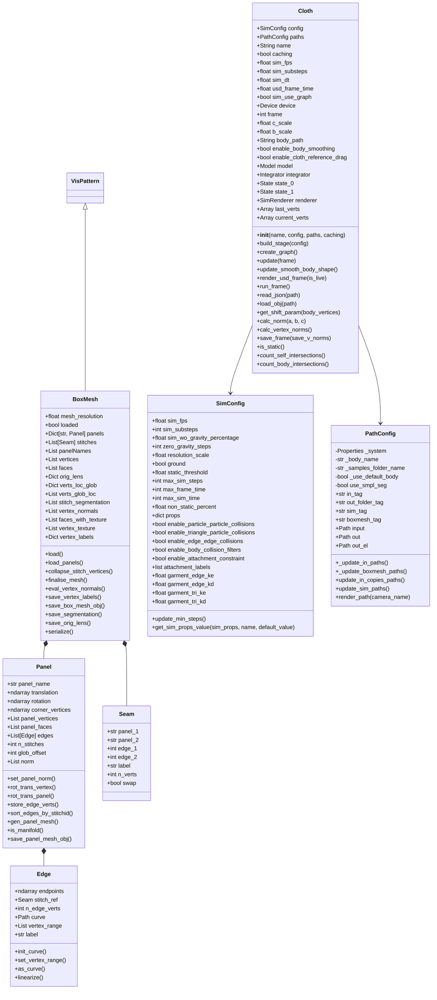

```mermaid
classDiagram
    VisPattern <|-- BoxMesh
    BoxMesh *-- Panel
    BoxMesh *-- Seam
    Panel *-- Edge
    Cloth --> SimConfig
    Cloth --> PathConfig

    class BoxMesh {
        +float mesh_resolution
        +bool loaded
        +Dict[str, Panel] panels
        +List[Seam] stitches
        +List panelNames
        +List vertices
        +List faces
        +Dict orig_lens
        +Dict verts_loc_glob
        +List verts_glob_loc
        +List stitch_segmentation
        +List vertex_normals
        +List faces_with_texture
        +List vertex_texture
        +Dict vertex_labels
        +load()
        +load_panels()
        +collapse_stitch_vertices()
        +finalise_mesh()
        +eval_vertex_normals()
        +save_vertex_labels()
        +save_box_mesh_obj()
        +save_segmentation()
        +save_orig_lens()
        +serialize()
    }

    class Panel {
        +str panel_name
        +ndarray translation
        +ndarray rotation 
        +ndarray corner_vertices
        +List panel_vertices
        +List panel_faces
        +List[Edge] edges
        +int n_stitches
        +int glob_offset
        +List norm
        +set_panel_norm()
        +rot_trans_vertex()
        +rot_trans_panel()
        +store_edge_verts()
        +sort_edges_by_stitchid()
        +gen_panel_mesh()
        +is_manifold()
        +save_panel_mesh_obj()
    }

    class Edge {
        +ndarray endpoints
        +Seam stitch_ref
        +int n_edge_verts
        +Path curve
        +List vertex_range
        +str label
        +init_curve()
        +set_vertex_range()
        +as_curve()
        +linearize()
    }

    class Seam {
        +str panel_1
        +str panel_2
        +int edge_1
        +int edge_2
        +str label
        +int n_verts
        +bool swap
    }

    class Cloth {
        +SimConfig config
        +PathConfig paths
        +String name
        +bool caching
        +float sim_fps
        +float sim_substeps
        +float sim_dt
        +float usd_frame_time
        +bool sim_use_graph
        +Device device
        +int frame
        +float c_scale
        +float b_scale
        +String body_path
        +bool enable_body_smoothing
        +bool enable_cloth_reference_drag
        +Model model
        +Integrator integrator
        +State state_0
        +State state_1
        +SimRenderer renderer
        +Array last_verts
        +Array current_verts
        +__init__(name, config, paths, caching)
        +build_stage(config)
        +create_graph()
        +update(frame)
        +update_smooth_body_shape()
        +render_usd_frame(is_live)
        +run_frame()
        +read_json(path)
        +load_obj(path)
        +get_shift_param(body_vertices)
        +calc_norm(a, b, c)
        +calc_vertex_norms()
        +save_frame(save_v_norms)
        +is_static()
        +count_self_intersections()
        +count_body_intersections()
    }

    class PathConfig {
        -Properties _system
        -str _body_name
        -str _samples_folder_name
        -bool _use_default_body
        -bool use_smpl_seg
        +str in_tag
        +str out_folder_tag
        +str sim_tag
        +str boxmesh_tag
        +Path input
        +Path out
        +Path out_el
        +_update_in_paths()
        +_update_boxmesh_paths()
        +update_in_copies_paths()
        +update_sim_paths()
        +render_path(camera_name)
    }

    class SimConfig {
        +float sim_fps
        +int sim_substeps
        +float sim_wo_gravity_percentage
        +int zero_gravity_steps
        +float resolution_scale
        +bool ground
        +float static_threshold
        +int max_sim_steps
        +int max_frame_time
        +int max_sim_time
        +float non_static_percent
        +dict props
        +bool enable_particle_particle_collisions
        +bool enable_triangle_particle_collisions
        +bool enable_edge_edge_collisions
        +bool enable_body_collision_filters
        +bool enable_attachment_constraint
        +list attachment_labels
        +float garment_edge_ke
        +float garment_edge_kd
        +float garment_tri_ke
        +float garment_tri_kd
        +update_min_steps()
        +get_sim_props_value(sim_props, name, default_value)
    }
```