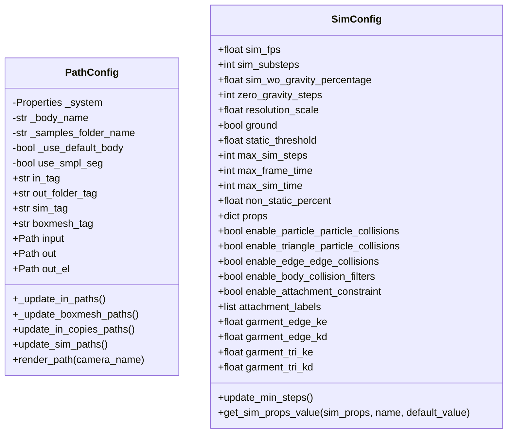

```mermaid
classDiagram
    class PathConfig {
        -Properties _system
        -str _body_name
        -str _samples_folder_name
        -bool _use_default_body
        -bool use_smpl_seg
        +str in_tag
        +str out_folder_tag
        +str sim_tag
        +str boxmesh_tag
        +Path input
        +Path out
        +Path out_el
        +_update_in_paths()
        +_update_boxmesh_paths()
        +update_in_copies_paths()
        +update_sim_paths()
        +render_path(camera_name)
    }

    class SimConfig {
        +float sim_fps
        +int sim_substeps
        +float sim_wo_gravity_percentage
        +int zero_gravity_steps
        +float resolution_scale
        +bool ground
        +float static_threshold
        +int max_sim_steps
        +int max_frame_time
        +int max_sim_time
        +float non_static_percent
        +dict props
        +bool enable_particle_particle_collisions
        +bool enable_triangle_particle_collisions
        +bool enable_edge_edge_collisions
        +bool enable_body_collision_filters
        +bool enable_attachment_constraint
        +list attachment_labels
        +float garment_edge_ke
        +float garment_edge_kd
        +float garment_tri_ke
        +float garment_tri_kd
        +update_min_steps()
        +get_sim_props_value(sim_props, name, default_value)
    }
```