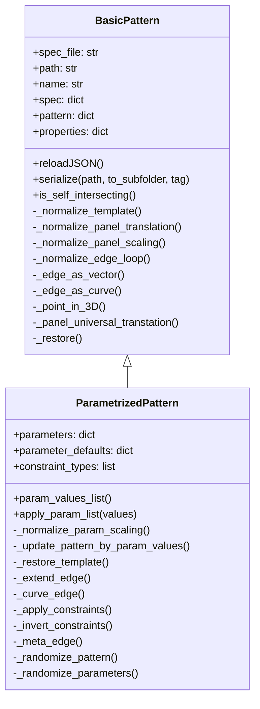

```mermaid
classDiagram
    class BasicPattern {
        +spec_file: str
        +path: str
        +name: str
        +spec: dict
        +pattern: dict
        +properties: dict
        +reloadJSON()
        +serialize(path, to_subfolder, tag)
        +is_self_intersecting()
        -_normalize_template()
        -_normalize_panel_translation()
        -_normalize_panel_scaling()
        -_normalize_edge_loop()
        -_edge_as_vector()
        -_edge_as_curve()
        -_point_in_3D()
        -_panel_universal_transtation()
        -_restore()
    }

    class ParametrizedPattern {
        +parameters: dict
        +parameter_defaults: dict
        +constraint_types: list
        +param_values_list()
        +apply_param_list(values)
        -_normalize_param_scaling()
        -_update_pattern_by_param_values()
        -_restore_template()
        -_extend_edge()
        -_curve_edge()
        -_apply_constraints()
        -_invert_constraints()
        -_meta_edge()
        -_randomize_pattern()
        -_randomize_parameters()
    }

    BasicPattern <|-- ParametrizedPattern
```
