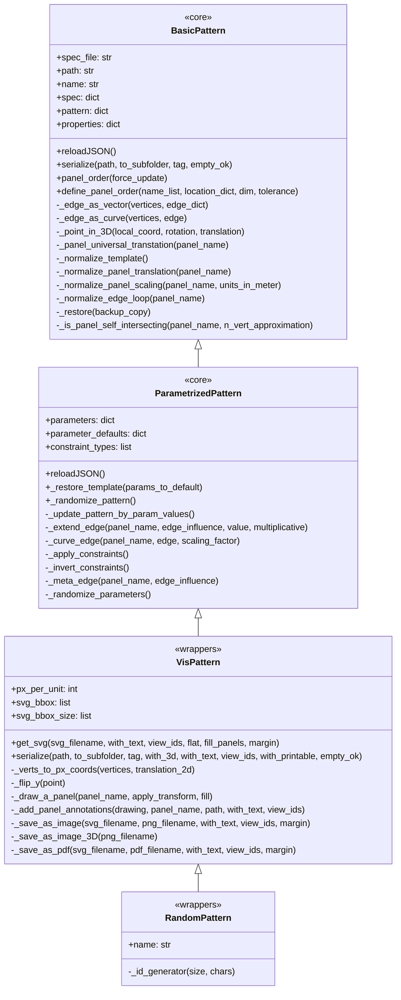

```mermaid
classDiagram
    class BasicPattern {
        <<core>>
        +spec_file: str
        +path: str
        +name: str
        +spec: dict
        +pattern: dict
        +properties: dict
        +reloadJSON()
        +serialize(path, to_subfolder, tag, empty_ok)
        +panel_order(force_update)
        +define_panel_order(name_list, location_dict, dim, tolerance)
        -_edge_as_vector(vertices, edge_dict)
        -_edge_as_curve(vertices, edge)
        -_point_in_3D(local_coord, rotation, translation)
        -_panel_universal_transtation(panel_name)
        -_normalize_template()
        -_normalize_panel_translation(panel_name)
        -_normalize_panel_scaling(panel_name, units_in_meter)
        -_normalize_edge_loop(panel_name)
        -_restore(backup_copy)
        -_is_panel_self_intersecting(panel_name, n_vert_approximation)
    }

    class ParametrizedPattern {
        <<core>>
        +parameters: dict
        +parameter_defaults: dict
        +constraint_types: list
        +reloadJSON()
        +_restore_template(params_to_default)
        +_randomize_pattern()
        -_update_pattern_by_param_values()
        -_extend_edge(panel_name, edge_influence, value, multiplicative)
        -_curve_edge(panel_name, edge, scaling_factor)
        -_apply_constraints()
        -_invert_constraints()
        -_meta_edge(panel_name, edge_influence)
        -_randomize_parameters()
    }

    class VisPattern {
        <<wrappers>>
        +px_per_unit: int
        +svg_bbox: list
        +svg_bbox_size: list
        +get_svg(svg_filename, with_text, view_ids, flat, fill_panels, margin)
        +serialize(path, to_subfolder, tag, with_3d, with_text, view_ids, with_printable, empty_ok)
        -_verts_to_px_coords(vertices, translation_2d)
        -_flip_y(point)
        -_draw_a_panel(panel_name, apply_transform, fill)
        -_add_panel_annotations(drawing, panel_name, path, with_text, view_ids)
        -_save_as_image(svg_filename, png_filename, with_text, view_ids, margin)
        -_save_as_image_3D(png_filename)
        -_save_as_pdf(svg_filename, pdf_filename, with_text, view_ids, margin)
    }

    class RandomPattern {
        <<wrappers>>
        +name: str
        -_id_generator(size, chars)
    }

    BasicPattern <|-- ParametrizedPattern
    ParametrizedPattern <|-- VisPattern
    VisPattern <|-- RandomPattern
```