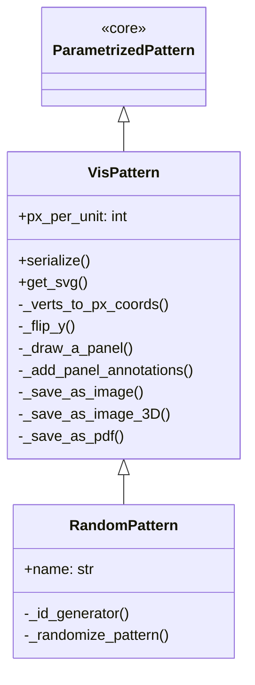

```mermaid
classDiagram
    class ParametrizedPattern {
        <<core>>
    }
    
    class VisPattern {
        +px_per_unit: int
        +serialize()
        +get_svg()
        -_verts_to_px_coords()
        -_flip_y()
        -_draw_a_panel()
        -_add_panel_annotations()
        -_save_as_image()
        -_save_as_image_3D()
        -_save_as_pdf()
    }
    
    class RandomPattern {
        +name: str
        -_id_generator()
        -_randomize_pattern()
    }
    
    ParametrizedPattern <|-- VisPattern
    VisPattern <|-- RandomPattern

```